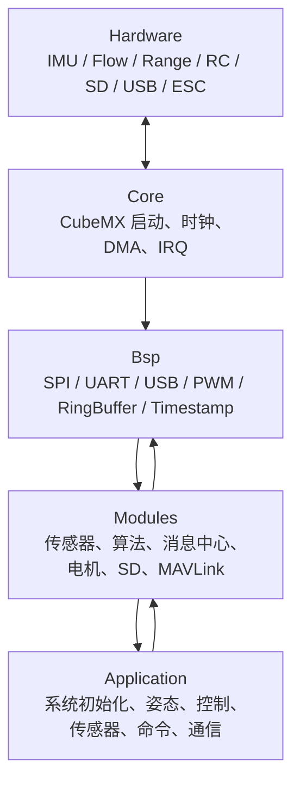
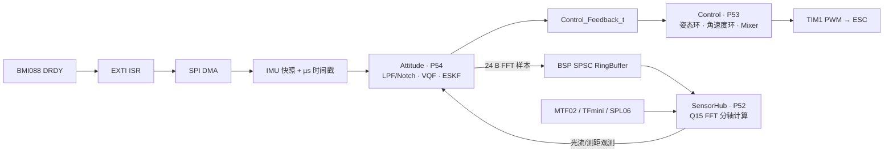
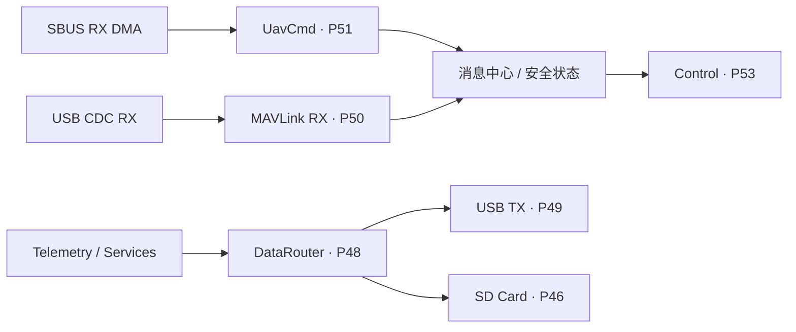

# STM32H743 UAV Flight Controller

基于 STM32H743 与 FreeRTOS 的四旋翼飞控固件，覆盖传感器采集、姿态/导航估计、级联控制、遥控安全链路、SD 黑匣子和 USB/MAVLink 通信。项目以“中断只搬运、任务做计算、数据所有权明确”为核心，面向嵌入式实时系统学习、飞控算法验证和个人作品集展示。

[](LICENSE)


> **安全提示**：固件会初始化电机 PWM。烧录、调试、解锁和首次验证必须拆除螺旋桨，并断开电机动力电源。本项目未经适航或功能安全认证，不可直接用于载人或高风险设备。

## 项目概览

| 项目 | 配置 |
|---|---|
| 主控 | STM32H743VIT6，Cortex-M7，400 MHz |
| 实时系统 | FreeRTOS，抢占式调度，任务优先级集中管理 |
| 主/备用 IMU | BMI088 / BMI270，SPI + DMA，数据就绪中断 |
| 姿态与导航 | VQF 姿态估计；并行 15 状态 ESKF；NED 导航系 |
| 外部观测 | MTF02 光流/测距、TFmini Plus 测距、SPL06 气压计 |
| 控制 | 姿态外环 + 角速度 PID + 四旋翼 Mixer，TIM1 PWM 输出 |
| 遥控与通信 | SBUS；USB CDC + MAVLink 2；FDCAN 扩展接口 |
| 数据记录 | SDMMC 4-bit + FatFs；飞行日志和 MAVLink 日志下载 |
| 调试分析 | SWD、SEGGER RTT/SystemView、DWT、主机回归测试 |

## 核心设计

- **事件驱动的 1 kHz 控制链路**：BMI088 数据就绪触发姿态任务，姿态结果再唤醒控制任务；1 ms 超时只执行安全检查，不用旧反馈重复运行控制律。
- **短中断设计**：UART、SPI 和传感器中断只完成原始数据搬运、时间戳记录和任务通知，协议解析与算法计算均在任务上下文执行。
- **双估计器分工**：VQF 输出低延迟控制姿态；ESKF 并行融合 IMU、光流和测距，提供 NED 位置与速度状态。
- **分时 Q15 FFT**：FFT 不占用姿态热路径，由现有 `sensor_hub` 任务按 X/Y/Z 分轴计算；使用 BSP 单生产者/单消费者环形缓冲区，不增加任务。
- **明确的 DMA/Cache 契约**：DMA 缓冲区放置、32 字节 Cache Line 对齐、Clean/Invalidate 时序及生产者/消费者所有权均显式处理。
- **非阻塞日志路径**：飞行任务只投递日志帧；SD 写盘和历史日志下载由低优先级任务完成，下载响应使用静态槽池与指针队列。
- **可复现的工程门禁**：提供 Debug、Release、SystemView 构建，11 项主机回归测试，以及格式、路径、敏感信息和生成物检查。

## 软件架构



分层边界如下：

| 层 | 职责 | 不应承担的工作 |
|---|---|---|
| `Core` | 芯片启动、HAL 句柄、中断入口、CubeMX 生成配置 | 飞行业务逻辑 |
| `Bsp` | 总线/设备抽象、DMA 与 Cache、时间戳、环形缓冲区 | 传感器协议和控制算法 |
| `Modules` | 设备协议、算法、消息、日志、MAVLink、电机输出 | 系统任务编排 |
| `Application` | 任务创建、数据流编排、状态机和安全策略 | 重复实现底层外设驱动 |

## 实时数据流





## 任务与调度

数值越大优先级越高，全部集中定义在 `Application/App_TaskPriorities.h`。

| 任务 | 优先级 | 栈（word） | 创建方式 | 唤醒/阻塞来源 |
|---|---:|---:|---|---|
| `bootstrap/defaultTask` | 55 | 512 | CMSIS-RTOS2 | 完成初始化后删除自身 |
| `Attitude` | 54 | 1536 | 静态 | 主 IMU 数据就绪通知 |
| `control` | 53 | 512 | 静态 | 姿态结果通知；1 ms 安全超时 |
| `sensor_hub` | 52 | 512 | 静态 | 传感器通知位/周期处理 |
| `uav_cmd` | 51 | 384 | 静态 | SBUS 通知/失联超时 |
| `mav_rx` | 50 | 768 | 启动期动态创建 | USB/MAVLink 接收 |
| `usb_tx` | 49 | 512 | 启动期动态创建 | USB 发送缓冲事件 |
| `data_router` | 48 | 768 | 启动期动态创建 | 输出路由队列 |
| FreeRTOS timer | 47 | 配置项 | 内核 | 软件定时器 |
| `sd_card` | 46 | 1024 | 静态 | 日志帧与下载请求 |

高优先级飞行任务不直接等待 USB 或 FatFs。通信和存储负载通过队列、环形缓冲区和固定槽池下沉到较低优先级任务。

## 实测性能摘要

以下数据来自整理前正式固件的两次无桨硬件测试，当前公开代码移除了私有性能探针，因此这些结果用于展示已经验证过的量级，**不是对当前提交的重新测量**。两组数据对应不同固件，不能横向拼接成一次测试；完整条件、样本数、固件哈希和限制见 [性能报告](Docs/PERFORMANCE.md)。

### Q15 FFT 改造后：完整控制路径

STM32H743VI 400 MHz，物理 BMI088 约 1 kHz，电机动力断开，目标端 DWT/FreeRTOS 计时。

| 场景 | CPU | DRDY→控制开始 avg/max | DRDY→控制业务完成 avg/max | 控制计算 avg/max | Deadline |
|---|---:|---:|---:|---:|---:|
| 解锁常规负载 | 20.7% | 110.843 / 218 µs | **121.690 / 234 µs** | 15.237 / 39.535 µs | 0 次超期 |
| 解锁组合满载有效窗口 | 51.5% | 115.486 / 236 µs | **129.900 / 253 µs** | 18.985 / 49.528 µs | 0 次超期 |

组合满载包含 25 Hz 遥控、约 1 kHz PING、约 500 Hz TIMESYNC、约 500 Hz HIL_SENSOR 解析和约 248.7 MB 历史日志下载。该次 90 s 主机压力脚本在约 35 s 后因 USB TX 队列饱和停止继续发送，因此这里只采用饱和前的有效双向窗口，不能据此宣称 90 s 全程满载通过。

| 算法/任务 | 样本 | min | avg | max | 说明 |
|---|---:|---:|---:|---:|---|
| Attitude 完整计算 | 33,006 | 19.160 µs | 57.842 µs | 160.440 µs | 含滤波、VQF、ESKF 预测及当次外部观测 |
| 单轴 512 点 Q15 FFT | 762 | 104.955 µs | 122.980 µs | 274.163 µs | 三轴分三个调度周期执行 |
| SensorHub release→finish | 41 s 窗口 | 6 µs | 29 µs | 320 µs | 5 ms deadline，0 次超期 |

33.073 s FFT 管线窗口内推送 33,073 个样本、消费 33,072 个、积压 1 个、丢弃 0 个，完成并发布 255 组三轴结果；估算 FFT 平均 CPU 占用约 0.288%。

### 物理遥控与 USB/SD 满载：系统资源

此组为 FFT 改造前的独立测试：物理 SBUS 约 129.6 Hz，同时进行 MAVLink 压力与历史日志下载。

| 指标 | 空闲基线 | 满载窗口 |
|---|---:|---:|
| CPU Load | 11.0% | 37.2% |
| Idle | 89.0% | 62.8% |
| 上下文切换 | 7,033 次/s | 16,186 次/s |
| Deadline 超期 | 0 | 0 |
| DataRouter 投递/分发 | — | 75,189 / 75,189 |
| 路由队列峰值 | — | 5 / 8 |
| 槽池耗尽 / 队列投递失败 / USB 入队丢弃 | — | 0 / 0 / 0 |

代表性 ISR 的 C 处理函数最大执行时间：BMI088 EXTI 4.568 µs、SPI2 RX DMA 5.585 µs、SDMMC 31.547 µs、USB FS 30.135 µs、MTF02 UART 25.510 µs。它们是进入 C Handler 后的耗时，不是外部边沿到 CPU 响应的中断延迟。

## 当前公开构建资源

2026-09-26 使用 Arm GNU Toolchain 13.3.1 构建 Debug、关闭 SystemView 自动启动、移除私有性能探针后的链接器结果：

| 内存区 | 已用 | 容量 | 占用率 |
|---|---:|---:|---:|
| FLASH | 314,988 B | 2 MiB | 15.02% |
| ITCM | 8,896 B | 64 KiB | 13.57% |
| DTCM | 19,080 B | 128 KiB | 14.56% |
| RAM_D1 | 249,744 B | 512 KiB | 47.63% |
| RAM_D2 | 83,552 B | 288 KiB | 28.33% |
| RAM_D3 | 0 B | 64 KiB | 0.00% |

## 快速开始

### 1. 准备工具

- CMake 4.0+
- Ninja
- Arm GNU Toolchain（已验证 13.3.1）
- Python 3
- clang-format
- 可选：OpenOCD 或 J-Link/Ozone、SEGGER SystemView

### 2. 构建与测试

```bash
cmake -S . -B build/debug -G Ninja \
  -DCMAKE_BUILD_TYPE=Debug \
  -DUAV_ENABLE_QUALITY_GATE=ON \
  -DUAV_SYSTEMVIEW_AUTOSTART=OFF
cmake --build build/debug
ctest --test-dir build/debug --output-on-failure
```

生成 `stm32h743_uav_flight_controller.elf/.hex/.bin`，仓库不提交二进制产物。Release、SystemView 和 OpenOCD 命令见 [构建与调试](Docs/BUILD_AND_DEBUG.md)。

### 3. 烧录前检查

1. 拆除螺旋桨并断开电机动力电源。
2. 核对板型、传感器方向、电机顺序和接收机 Failsafe。
3. 烧录后先验证传感器、姿态和上锁状态，再测试 PWM。
4. 修改 PID、坐标系、Mixer、DMA 缓冲或中断优先级后，重新执行无桨回归。

## 仓库结构

```text
Application/   飞行任务、控制、姿态估计与通信服务
Bsp/           SPI/I2C/UART/USB/PWM/时间戳/环形缓冲区等板级抽象
Modules/       传感器、算法、消息中心、电机、SD 日志与 MAVLink
Core/          STM32CubeMX 生成的启动、外设和中断代码
Tests/         11 项主机回归与源码契约测试
Tools/         构建和质量检查脚本
Docs/          架构、硬件、构建、规范、安全、性能和验证资料
```

## 文档导航

- [系统架构与数据流](Docs/ARCHITECTURE.md)：分层、飞行链路、通信/日志链路和任务关系。
- [硬件、接口与引脚](Docs/HARDWARE.md)：传感器总线、电机映射和 DMA/Cache 约束。
- [构建、烧录与 SystemView](Docs/BUILD_AND_DEBUG.md)：三种构建配置、烧录和性能抓取步骤。
- [性能报告与复现方法](Docs/PERFORMANCE.md)：历史实测明细、当前静态资源和复测口径。
- [代码规范](Docs/CODE_STYLE.md)：命名、Doxygen、线程上下文、单位和生成代码边界。
- [安全边界](Docs/SAFETY.md)：无桨验证、解锁、失联和实飞前检查。
- [发布验证记录](Docs/RELEASE_VALIDATION.md)：来源审计、构建/测试结果和未完成硬件项。
- [第三方软件声明](THIRD_PARTY_NOTICES.md)：ST、Arm、FreeRTOS、FatFs、VQF、MAVLink、SEGGER 等许可说明。

## 当前验证边界与后续工作

- 当前公开代码已通过 Debug、Release、RelWithDebInfo/SystemView 构建和 11/11 主机回归，但清理性能探针后尚未重新执行完整无桨压力测试。
- Q15 FFT 满载测试中的 USB TX 饱和需要独立定位，并完成不少于 90 s 的稳定双向压力复测。
- 历史 ISR 表测量的是 Handler 执行时间；中断响应延迟和 p95/p99 仍需用一致的 SystemView/ETM 方法补测。
- 滤波器和动态陷波效果仍需使用已知频率的振动输入台架验证。
- PID、Mixer、失联保护和传感器方向必须针对实际机架完成系留、低高度悬停和日志复核。

## 致谢与参考

项目的公开文档组织和工程化呈现参考了 [HNU YueLu RM `basic_framework`](https://gitee.com/hnuyuelurm/basic_framework) 的分层说明、功能导航与上手流程；本仓库的飞控实现、硬件配置和文档内容均根据自身代码重新整理，并未复制其源码。

## License

项目自有代码采用 [MIT License](LICENSE)。第三方组件继续遵循各自许可证，详见 [THIRD_PARTY_NOTICES.md](THIRD_PARTY_NOTICES.md)。

## English summary

This portfolio repository contains a FreeRTOS-based STM32H743 quadrotor flight controller. It implements an event-driven IMU-to-attitude-to-control pipeline, VQF attitude estimation, a parallel 15-state ESKF, optical-flow/range fusion, SBUS input, SD flight logging, USB/MAVLink transport, cache-aware DMA handling, and optional SEGGER SystemView tracing. Source code and reproducible build/tests are included; generated firmware binaries are intentionally excluded.
